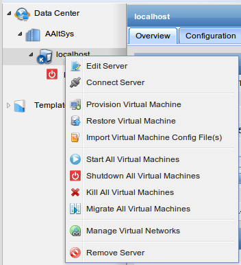
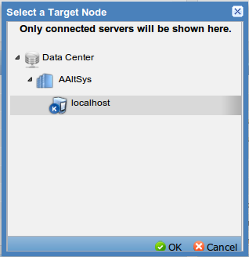
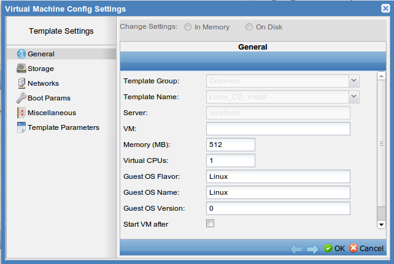

###########################
 ConVirt 2.0 Administration
###########################

The AAltSys Server provides the KVM virtualization platform, allowing for multiple
operating systems to be installed and virtualized. These virtualized operating
systems can be run simultaneously and behave as though they were independent
computers on the network.

Connecting to the Administration Console
========================================

KVM virtualization on the AAltSys Server is administered through the ConVirt 2.0 
web interface. ConVirt may be selected from the server console menu, or from a 
workstation on the network, point a web browser to address http://aaltsysserver:8081/\ .

Administering Virtual Networks
==============================

Virtual machines need to be connected to a network device of some sort. KVM uses
virtual devices which then pass data off to the physical network. It may be desirable
to set up multiple virtual networks to isolate different virtual machines from 
one another for security. To manage virtual networks:

+ On the left menu, navigate to the server where the networks are to be managed:
	| The default AAltSys Server is found at :menuselection:`Data Center --> AAltSys --> localhost`.
+ Right-click on the server and choose *Manage Virtual Networks*:
	| This dialog lists all currently existing virtual networks.
+ Add new networks using the :guilabel:`(+) New` button.
+ Edit or delete existing networks with the :guilabel:`Edit` and :guilabel:`Remove` buttons.

.. image:: _images/convirt_server_network.png

Provisioning New Virtual Machines
=================================

+  On the left menu, click to expand :menuselection:`Template Library`
+  Right-click the template for a new virtual machine, and select :menuselection:`Provision` from the context menu.

+  In the :guilabel:`Select a Target Node` window, expand viewed items to show servers.
+  Select either a managed server or a server pool to provision the virtual machine on.

+  The :guilabel:`Virtual Machine Config Settings` window will display.

      +  Enter a name for the virtual machine in the :guilabel:`VM` field. *(Example: WebServer)*
      + Specify the amount of memory (RAM) available to the virtual machine in megabytes. *(Example: 512)*
      + Specify the number of virtual processors available to the virtual machine.
      + Specify details of the operating system to be installed in the virtual machine.

   .. Note::
      Convirt allows any amount of memory and any number of processors to be assigned.
      Take care not to exceed the physical limits of the hardware.

+  Click :guilabel:`Storage` to specify the physical CD-ROM device on the server:
   (If an ISO image has been copied to the server it can be used by editing VM 
   Device *hdc:cdrom*.)
+  Click :guilabel:`Networks` and specify machine connections to virtual networks.
+  Click :guilabel:`Boot Params` and specify advanced boot parameters for the system.
+  Click :guilabel:`Miscellaneous` for advanced virtual machine settings (not described).
+  Click :guilabel:`Template Parameters` for additional system settings (not described):
   Specify *hda_disk_size* to set the virtual hard disk drive size in megabytes.
+  Click :guilabel:`OK` to complete the VM specification and begin installation.
 
