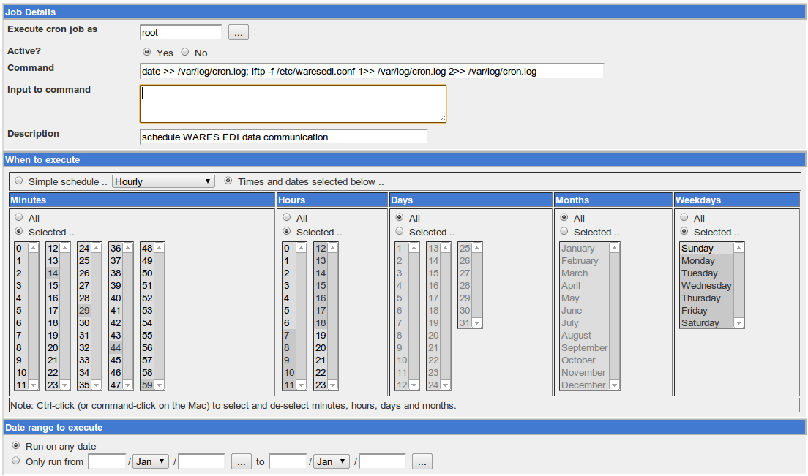
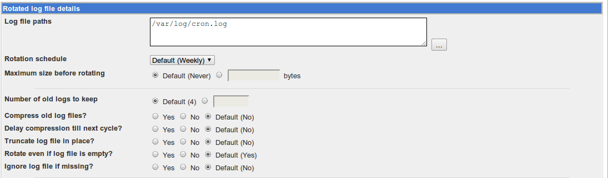

.. _ediconfig:

#############################
Configuring EDI Communication
#############################

EDI is a complex application involving data communication, text file 
manipulation and archival, document translation, and database mapping. This 
document will describe configuring a Linux machine to exchange data with an ftp 
server on the web for EDI.

#. First, the Linux machine must have a competent ftp client. Install lftp with 
   the command::

      sudo apt-get install lftp

#. Second, change owner permissions on the WARES program files with the 
   commands::

      sudo chgrp -R __USERS__ /home/samba/shares/arev
      sudo chmod -R g+s /home/samba/shares/arev

#. Third, lftp will run in non-interactive mode, taking its commands from a 
   script file. The script file should be saved as :file:`/etc/waresedi.conf`, 
   with owner **root:root** and permissions **600**. The text of a sample file 
   follows::

      lcd /home/samba/shares/arev/connect
      open -u {uname},{passwd} {ftp://serverURL}
      mput -c -E ./snd/* -O ./{OUTBOX}
      mget -c -E ./{INBOX}/* -O ./rcv
      quit

Schedule Exchange in Webmin
============================

Using *Webmin*, :menuselection:`System --> Schedule` cron jobs, make a job with 
the following command::

   date >> /var/log/cron.log; lftp -f /etc/waresedi.conf 1>> /var/log/cron.log 2>> /var/log/cron.log

Schedule the job to run every 15 minutes between 7 am and 7 pm. Test run the 
job, and check the output with the command::

   cat /var/log/cron.log

Finally, manage the log file: System --> Log File Rotation --> Add a new log 
file to rotate. Accept the default management options for the new log.

