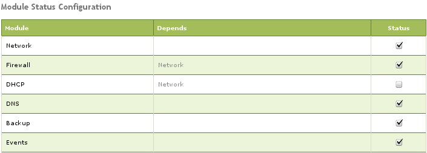
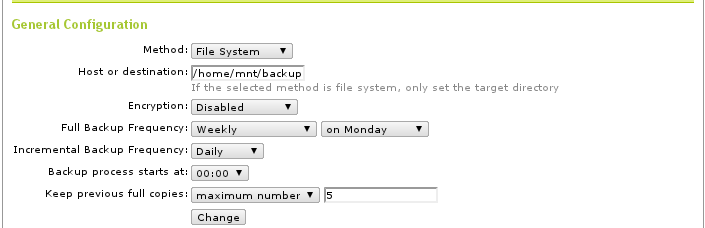
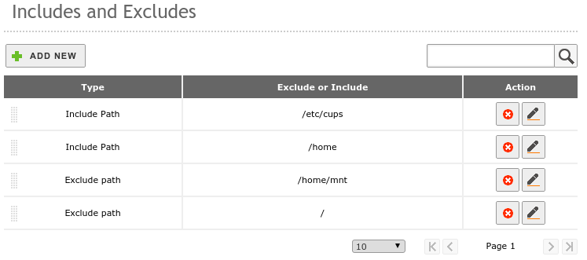
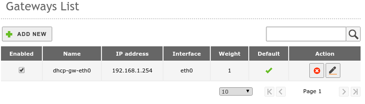
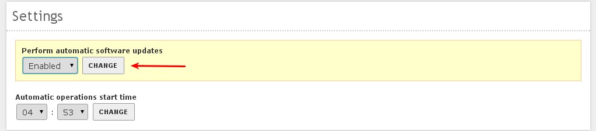
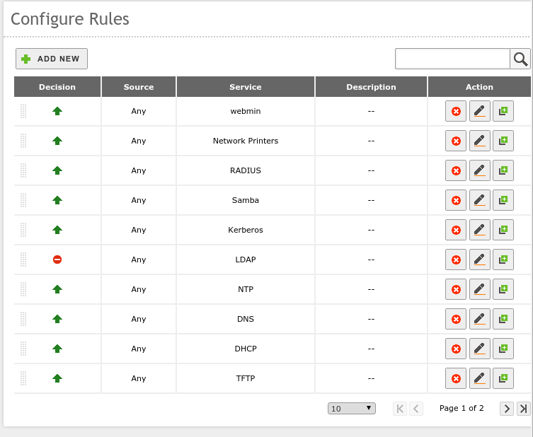
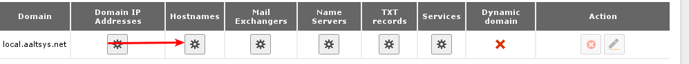
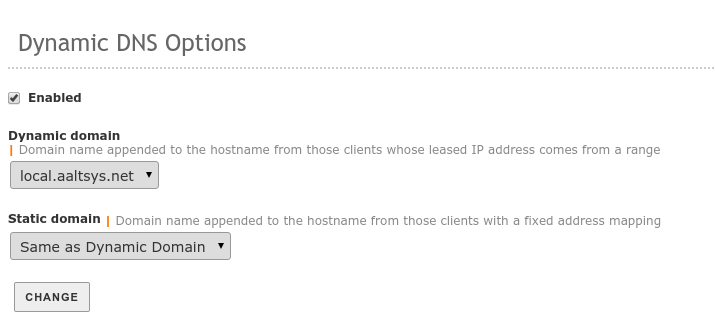
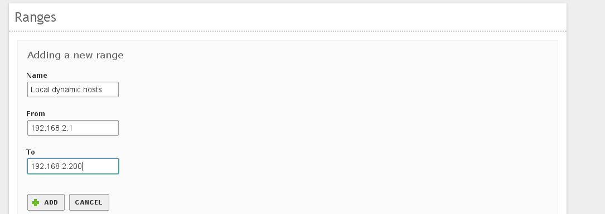

.. _configure:

##########################
 Zentyal Configuration
##########################

Follow this guide to setup and manage an AAltSys Server using Zentyal.
Documentation for Zentyal itself is found at http://doc.zentyal.org/en.

.. Note:: Your server is administered with Zentyal using the Firefox web 
   browser, and other browsers may not work correctly. Specifically, versions 
   of Microsoft's Internet Explorer which do not conform to HTML5 standards 
   cannot be used to administer Zentyal.

There are thee accepted ways to access Zentyal administration:

+ At the server console, login to the system as the administrator, or
+ At a local workstation, go to browser address https://__server.IP.address__, 
  or
+ At a local workstation, go to browser address https://__hostname__.

Login to Zentyal using your administrator :kbd:`__username__` and 
:kbd:`__password__` to perform the following initial configuration steps.

Module Status
==========================

On the Zentyal menu, select :menuselection:`Core --> Module Status`. Check that 
all installed modules are active; that is, that their statuses are checked. The 
following image from a new install shows the DHCP module unchecked. (DHCP 
should be checked only on servers used as network gateways.)  After activating 
modules, click on ``Save Changes`` in the top bar, and then click ``Save`` to 
finalize the change.

General Information
==========================

Check the information on the :menuselection:`System --> General` page 
for any installation entry errors.

.. Note:: Zentyal 2.2: The password change option on this page requires special 
  procedures, as described in :ref:`change_password`.

System Backup
==========================

Configure backups at :menuselection:`Core --> System --> Backup`. Display
the :guilabel:`Configuration and Status` tab, and set the following options
to tell Zentyal how to backup:

+------------------------------------+----------------------------------+
| Setting                            | Value                            |
+====================================+==================================+
| Host or Destination                | ``/home/mnt/backup``             |
+------------------------------------+----------------------------------+
| Full backup frequency              | ``Weekly -- on Monday``          |
+------------------------------------+----------------------------------+
| Keep previous full copies          | ``maximum number -- 5``          |
+------------------------------------+----------------------------------+

Below is a screen shot of these settings.

Now click the :guilabel:`Includes and Excludes` tab to tell Zentyal what
to backup. Click `Add new` to add each of the following entries, going up
from the bottom of this list:

+------------------------------------+----------------------------------+
| Type                               | Exclude or Include               |
+====================================+==================================+
| Include Path                       | ``/etc/cups``                    |
+------------------------------------+----------------------------------+
| Include Path                       | ``/home``                        |
+------------------------------------+----------------------------------+
| Exclude Path                       | ``/home/mnt``                    |
+------------------------------------+----------------------------------+
| Exclude Path                       | ``/``                            |
+------------------------------------+----------------------------------+

Then delete any entries not on the above list, leaving the four lines 
displayed in the following image:

Network Interfaces
==========================

At :menuselection:`Core --> Network --> Interfaces`, There are two possible 
configurations for the network interface ``eth0`` depending on whether the 
server will be used as a network gateway or as a peer on a LAN.

For network gateways, we recommend configuring ``eth0`` with method :kbd:`DHCP`,
and the :guilabel:`External (WAN):` box must be checked. 

.. note:: When a gateway server is reconfigured from :kbd:`DHCP` to 
  :kbd:`static`, a default gateway record must be added as well. Changing from 
  :kbd:`static` to :kbd:`DHCP` requires deleting the default gateway first.

Where a server is a LAN peer, only ``eth0`` should be connected. The interface 
should be set to a static IP address, and the :guilabel:`External (WAN):` box 
must not be checked. An example of this configuration is illustrated following.

.. image:: _images/zentyal_07_interfaces.png

More details on Zentyal networking are found at :ref:`resources:network`.

Network Gateway
==========================

When ``eth0`` is an external interface configured to obtain its IP address 
through DHCP, Zentyal should configure the Internet gateway for your system as 
the following example shows.

Network Services
==========================

In section :menuselection:`Core --> Network --> Services`, a Network Service 
definition must be added so that firewall rules can be created later. First 
click :kbd:`add new` to add the following service:

+----------------------------+-----------------------------------------------+
| Service Name               | Description                                   |
+============================+===============================================+
| webmin                     | ``AAltsys webmin service``                    |
+----------------------------+-----------------------------------------------+

Once the new service is added to the list, click the :guilabel:`Configuration` 
button for ``webmin`` and add a configuration for:

+-----------------------+----------------------------------------------------+
| Protocol:             | ``TCP/UDP``                                        |
+-----------------------+----------------------------------------------------+
| Source port:          | ``any``                                            |
+-----------------------+----------------------------------------------------+
| Destination:          | ``Single port --> 10000``                          |
+-----------------------+----------------------------------------------------+

The resulting configuration is displayed following:

.. image:: _images/zentyal_11_webmin.png

.. Tip:: Remember to click :kbd:`Change` when making configuration changes.

Software Management
==========================

At menu selection :menuselection:`Core --> Software Management --> Settings`: 
for the setting :guilabel:`Perform automatic security updates`, choose 
``Enabled``, and remember to click ``Change``, as shown following.

.. note:: The Zentyal 3.0 :guilabel:`Gateway` menu section was formerly known 
  as :guilabel:`UTM`.

Firewall Packet Filter
==========================

Select :menuselection:`Gateway --> Firewall --> Packet Filter --> internal networks 
to Zentyal` on the Zentyal menu to insert a new firewall rule for the Network 
Service defined previously. Click the ``Configure rules`` link below 
:guilabel:`Filtering rules from internal networks to Zentyal.` Then click 
``Add new`` to enter this rule:

+-------------+--------------+--------------+-------------------+
| Decision    | Source       | Service      | Description       |
+=============+==============+==============+===================+
| ACCEPT      | Any          | webmin       | (blank)           |
+-------------+--------------+--------------+-------------------+

The new rule will be positioned at the top of the list as shown following:

IDS
==========================

At :MenuSelection:`Gateway --> IDS`, check the :guilabel:`Enabled` box 
for :guilabel:`eth0` in the :guilabel:`Intrusion Detection System`.

DNS
==========================

At :menuselection:`Infrastructure --> DNS`, click ``Add new`` under 
:guilabel:`Forwarders` to add your ISP's forwarding DNS entries, or enter IP 
addresses for known good DNS servers. (Google DNS servers are shown here.) 

.. note:: Zentyal 2.2: Click ``Add new`` under :guilabel:`Domains` to add a new 
  local domain, :kbd:`local.aaltsys.net`, but do not enter an IP address. 

The following image shows the resulting DNS page:

.. Note:: The :guilabel:`local.aaltsys.net` domain is not checked as 
  :guilabel:`Dynamic`. This feature will be configured in the ``DHCP`` section 
  to follow.

+ Click the configuration icon below :guilabel:`Hostnames` on the 
  :guilabel:`local.aaltsys.net` domain. 
+ Click the configuration icon below :guilabel:`Alias` on the 
  :kbd:`__hostname__` host, then click ``Add new`` to add a new alias.
+ Type a new alias :kbd:`aaltsysserver` for this host, then click :kbd:`add` to 
  accept it.

DHCP
==========================

.. Note:: Skip this section if you are not configuring a network gateway server.

Use section :menuselection:`Infrastructure DHCP` to configure interface 
``eth1``. (Only static internal interfaces provide DHCP services.) Settings 
for the :guilabel:`Common options` follow:

+----------------------------+-------------------------------------------+
| Option name                | Setting value                             |
+============================+===========================================+
| Default gateway            | ``Zentyal``                               |
+----------------------------+-------------------------------------------+
| Search domain              | ``Zentyal domain --> local.aaltsys.net``  |
+----------------------------+-------------------------------------------+
| Primary name server        | ``local Zentyal DNS``                     |
+----------------------------+-------------------------------------------+
| Secondary name server      | (IP of your DSL or cable modem)           |
+----------------------------+-------------------------------------------+
| NTP server                 | ``local Zentyal NTP``                     |
+----------------------------+-------------------------------------------+
| WINS server                | ``none``                                  |
+----------------------------+-------------------------------------------+

.. Tip:: 

	 The :guilabel:`Secondary nameserver` value should be set to the IP address 
	 of your DSL or cable interface.

Click ``Change`` to save the :guilabel:`Common options` settings. The following 
screenshot shows a DHCP configuration, where the cable modem uses IP address 
:kbd:`192.168.1.254`.

.. image:: _images/zentyal_33.1_common.png

Click the :guilabel:`Dynamic DNS Options` tab on the DHCP page, and click the 
:guilabel:`Enabled:` checkbox, and click ``Change``. The settings on this page 
should be:

+----------------------------+-------------------------------------------+
| Option name                | Setting value                             |
+============================+===========================================+
| Enabled                    | (Checked)                                 |
+----------------------------+-------------------------------------------+
| Dynamic domain             | ``local.aaltsys.net``                     |
+----------------------------+-------------------------------------------+
| Static domain              | ``Same as Dynamic Domain``                |
+----------------------------+-------------------------------------------+

The following screenshot shows :guilabel:`Dynamic DNS Options` settings:

Under :guilabel:`Ranges`, click ``Add new`` to add an IP address range for 
dynamic IP assignment in your local subnet. We recommend excluding addresses 
above ``x.x.x.200`` to provide static IP address space, so our default settings 
are:

+------------------+----------------------------------------------------+
| Name:            | ``Local dynamic hosts``                            |
+------------------+----------------------------------------------------+
| From:            | ``192.168.2.1``                                    |
+------------------+----------------------------------------------------+
| To:              | ``192.168.2.200``                                  |
+------------------+----------------------------------------------------+

Click ``Add`` to complete the change. The result is displayed following:

Save Changes
==========================

Click ``Save changes`` in the Zentyal title bar, and under :guilabel:`Save 
configuration`, click ``Save``. Your server functions are configured, and now 
office use can be set up.