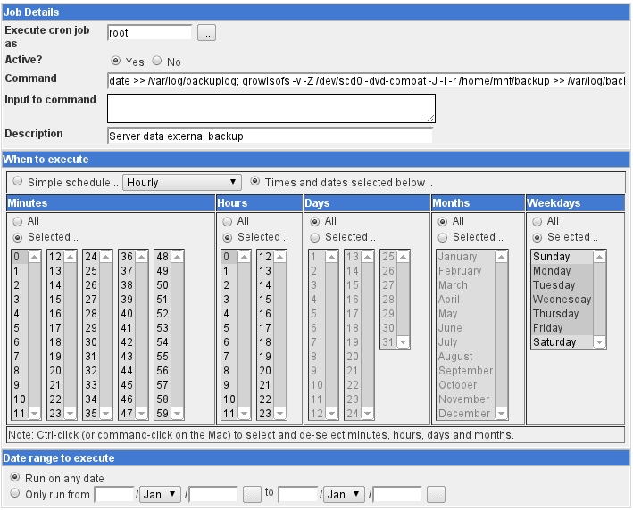
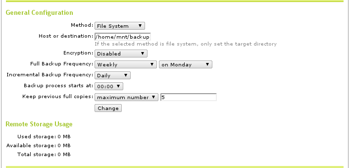
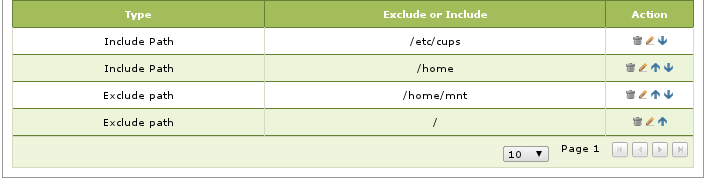

#############################
 Backing Up Server Data
#############################

The AAltSys Server provides robust, simple, and inexpensive options for data 
backup. Backups can be written to DVDs for a small amount of information, but 
we recommend using auto-mounted USB or eSATA drives to handle large data sets. 

Restoring Backups
=============================

Backups are stored in Duplicity rsync format. Duplicity is available for free 
on Linux and Mac. The Linux version of Duplicity can execute on Windows under 
Cygwin; an ISO image of Duplicity encapsulated in Cygwin is being developed. 

.. _backup_configuration:

Performing a Demand Backup
=============================

To manually perform a backup on Zentyal 2.2 or later run one of the following 
commands::

  sudo /usr/share/zentyal-ebackup/backup-tool --full
  sudo /usr/share/zentyal-ebackup/backup-tool --incremental

To manually perform a backup on Zentyal 2.0 (older) run one of these commands::

  sudo /usr/share/ebox-ebackup/ebox-remote-ebackup --full
  sudo /usr/share/ebox-ebackup/ebox-remote-ebackup --incremental

Backup Configuration
=============================

Backups are written inside of the **/home** directory. The directory for backups 
is created with the terminal command::

  sudo mkdir -p /home/mnt/backup/source_config

Linux cron jobs perform backup functions. Zentyal manages cron tab entries for 
Duplicity operations. Writing backup files to external media requires entering 
cron jobs using Webmin. An example entry for writing to DVD is shown following:

The software for writing DVDs may be missing from the OS. It is installed with 
the command::

  sudo apt-get install dvd+rw-tools

Configure Zentyal
-----------------------------

Backups are managed in Zentyal. From the universe of potential configurations, 
the following arrangement is suggested to provide the flexibility and capability 
required in most situations.

+ Open Zentyal, and navigate to tab :menuselection:`Core --> Backup --> Configuration and Status`
+ Set the backup path to :kbd:`/home/mnt/backup`
+ Leave prompts ``User:`` and ``Password:`` blank
+ Fill in a schedule for full and incremental backups as shown following:

+ Navigate to tab :menuselection:`Core --> Backup --> Includes and Excludes`
+ Enter Includes and Excludes as shown in the following image:

Moving Home Files to Server
-----------------------------

Storing important files on workstation hard drives is not only risky, but 
inconvenient to business operations. Instead, a user should manage files in 
server directories. To guarantee that new files are created there, set the 
user's server home folder as the default directory in programs. Server-based 
home folders work across platforms such as Windows PCs and Apple desktops, 
as described in the following table:

+--------------------+------------------------------+------------+-----------------+
| Workstation type   | Connection to server home    | Works from | Instructions    |
+====================+==============================+============+=================+
| LTSP terminals     | uses /home/$USER by default  | local only | no instructions |
+--------------------+------------------------------+------------+-----------------+
| Windows PCs        | maps /home/$USER to drive H: | local only | instructions    |
+--------------------+------------------------------+------------+-----------------+
| Linux workstations | ssh link to /home/$USER      | Internet   | instructions    |
+--------------------+------------------------------+------------+-----------------+
| Apple desktops     | ssh link to /home/$USER      | Internet   | instructions    |
+--------------------+------------------------------+------------+-----------------+

What Is Backed Up
-----------------------------

+ Server configuration data, eBox Database 
+ Printer configuration data, /etc/cups
+ Virtual machine images, /home/convirt
+ Shared files, /home/samba/shares/...
+ Home directories, /home/$USER...

What Is Not Backed Up
-----------------------------

The base operating system of the server is not backed up. For an OS backup to 
be useful, we would need to answer the following questions:

+ How can you backup the operating system when it is running?
+ Without a working operating system, how would you restore the OS?

Instead of trying to backup the server OS, we have made AAltSys Server OS 
installation relatively fast and simple. Keep the AAltSys or Zentyal install 
DVD handy, along with a list of any console changes to the server 
configuration.

Creating a Server Clone Image
=============================

Use the CloneZilla utility disk to create a complete server image, stored on 
your backup drive.

------------------------------

.. _backup_drive_setup:

Automount Drive Setup
=============================

.. warning:: When using the ASUS P5BV motherboard, do not connect an external 
   drive over eSATA for scheduled backups, as this can result in corrupted RAID 
   arrays. (Type 1 RAID arrays connected to the SATA3 ports on SuperMicro X9SCM 
   motherboards are safe from this problem.) Zentyal 3.0 automounts USB 
   devices, which interferes with fuse autofs mounts for backup drives 
   connected using USB. Install :file:`mountbackup.sh` ass described following 
   to avoid this problem.

In this example, an eSATA backup drive is configured as an extended partition 
hard drive formatted NTFS. Since Linux does not honor file permissions on NTFS 
volumes, the backup will be readable by anyone.

Part 1: Install autofs
-----------------------------

Display a terminal command line on the server console, or ``ssh`` to a server 
command shell. At the command prompt, type::

  sudo apt-get install autofs ntfsprogs

For Zentyal 3.0, download :download:`this program <_downloads/mountbackup.sh>` 
to :file:`/usr/local/bin/mountbackup.sh` and setup a cron job to execute the 
script with root privileges every minute.

Part 2. Format drive NTFS
-----------------------------

A drive must be formatted before use. We recommend NTFS file system for the 
external backup drive, as then it can be read from either Linux or Windows. 
Use the following instructions to perform this format:

.. Warning:: These instructions assume that the external drive is device 
   **sdc**, and you are using data partition **sdc1**. Verify this, or replace 
   **sdc1** in the following instructions with the correct parameter for your 
   specific system. All instructions are intended to be executed at a terminal 
   command prompt.

#. Identify the device to format::

     ls -al /dev/sd*

#. If mounted, unmount the drive volume with one of the following commands::

     sudo service autofs stop (for an automounted drive).
     sudo umount /dev/sdc (For a standard mount point). 

#. Verify the device is unmounted::

     mount

#. Use **fdisk** to remove partitions, create a fresh partition, set type to 7 (NTFS/HPFS):: 

     sudo fdisk /dev/sdc
     u
     c
     n,p,<Enter>,<Enter>
     t,7
     w

#. Format the new partition NTFS, label it BACKUP::

    sudo mkntfs -L BACKUP -f /dev/sdc1

.. warning:: Creating a new drive partition changes the UUID for the drive 
   mount. When a drive has been automounted in the past, partitioning  must be 
   followed by the automount steps below before autofs can mount the drive.

Part 3: Identify the device
-----------------------------

.. note:: Once a drive is formatted, a bash script is provided to perform Part 
   3 of this document. From the web browser on the server, download 
   :download:`this script <_downloads/backupdrive.sh>` and save it in your home
   folder. Then execute the script with the command::

      sudo bash backupdrive.sh BACKUP

The drive device will be discovered and then mounted to logical mount point 
``/home/mnt/backup``.

#. Plug in the hot-pluggable device on a **USB** port (eSATA is risky).
#. At the command prompt, type::

     sudo blkid

#. Output similar to the following will be displayed::

    /dev/sda1: UUID="27d7b97c-d615-4fff-9c55-ab714176ab29" TYPE="ext4"
    /dev/sda5: UUID="25630530-a7b8-442c-9c2d-57ea5eab109b" TYPE="swap"
    /dev/sda6: UUID="cf5aed21-730f-42bc-8a63-b068884772b5" TYPE="ext4"
    /dev/sdb1: UUID="27d7b97c-d615-4fff-9c55-ab714176ab29" TYPE="ext4"
    /dev/sdb5: UUID="25630530-a7b8-442c-9c2d-57ea5eab109b" TYPE="swap"
    /dev/sdb6: UUID="cf5aed21-730f-42bc-8a63-b068884772b5" TYPE="ext4"
    /dev/mapper/ddf1_aaltsys1: UUID="27d7b97c-d615-4fff-9c55-ab714176ab29" TYPE="ext4"
    /dev/mapper/ddf1_aaltsys5: UUID="25630530-a7b8-442c-9c2d-57ea5eab109b" TYPE="swap"
    /dev/mapper/ddf1_aaltsys6: UUID="cf5aed21-730f-42bc-8a63-b068884772b5" TYPE="ext4"
    /dev/sdc5: LABEL="HD-HSQ" UUID="363404743404397F" TYPE="ntfs"

This example shows block device ``/dev/sdc5``, UUID ``363404743404397F``, of ``TYPE="ntfs"``.

.. Warning:: In the following commands, replace **$UUID** with the identifier 
   **YOU OBTAINED** from the instructions in Part 3.

At the command prompt, type::

  sudo service autofs stop
  sudo mkdir -p /home/mnt/backup/source_config
  sudo bash < <(echo 'echo "/home/mnt  /etc/auto.home_mnt  --timeout=30 --ghost" >> /etc/auto.master')
  sudo bash < <(echo 'echo "backup  -fstype=auto,sync  :/dev/disk/by-uuid/$UUID" >> /etc/auto.home_mnt')
  sudo service autofs start

.. hint:: Did you remember to replace $UUID with your partition identifier?

Part 4: Verify drive mounting
-----------------------------

Type the commands::

  ls /home/mnt/backup
  touch /home/mnt/backup/@@external@@

.. Note:: This procedure created a file directory on the local drive as well as 
   the target directory on the external drive. When the external drive is 
   disconnected, turned off, or failed, the file ``@@external@@`` will not 
   display with the command ``ls /home/mnt/backup/@@*``.

Disconnect automounted drive
-----------------------------

Your device is mounted with a 30-second timeout. To avoid corruption, count 
to 60 before disconnecting the drive. When a drive will remain disconnected, 
autofs interferes with using the underlying file system of the system drive.
Reconfigure autofs to ignore the file system mount point as follows::

	 sudo sed -i '$d' /etc/auto.master
	 sudo service autofs restart
