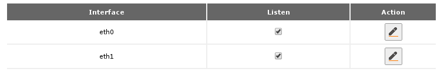
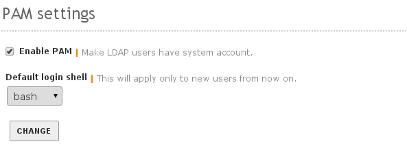
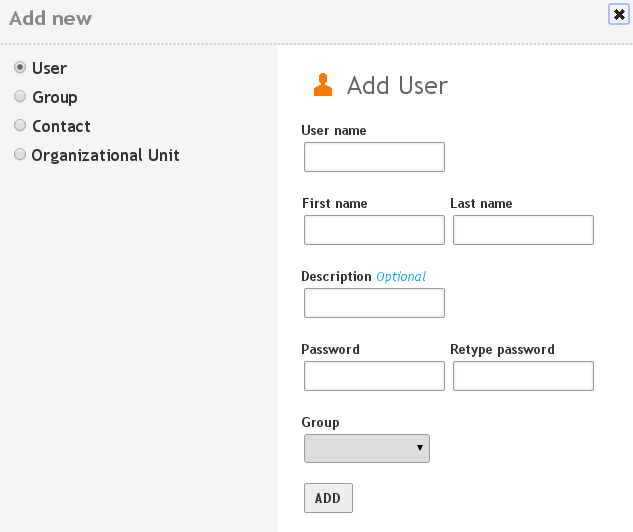

##########################
 Office File Sharing
##########################

This article describes activities in the **Office** section of the left menu.

.. Note:: This section presents tasks in dependency order, so that each section 
   is visited only once.

Printer Sharing
==========================

Zentyal uses CUPS, or Common Unix Printing System, to define network printers
and share them through the server. To begin, make a list of network-attached 
printers, their manufacturers, models, and IP addresses.

Then open Zentyal by one of the following approaches:

+  On the host console, open a Firefox session at :kbd:`https://localhost`
+  At a local workstation, browse to address :kbd:`https://__hostname__`
+  At a local workstation, browse to address :kbd:`https://192.168.2.241`

Go to :menuselection:`Office --> Printer Sharing`, and make sure that the
``Listen`` checkbox is checked for each active interface, as shown following.

.. Note:: The CUPS web interface can be displayed only in the local network.
   Therefore only local workstations or the server console can administer CUPS. 

   The browser may present a certificate warning the first time you use 
   CUPS. Accept this certificate; it is perfectly safe to do so. This certificate 
   is issued from your local server for use by the server.

+  Press :kbd:`<Ctrl-T>` to open a new browser tab.
+  Enter the web address :kbd:`https://192.168.2.241:631`
+  If required, follow your browser's instructions to add a security exception.

.. note:: Zentyal 2.2: Below :guilabel:`Printer Sharing`, click the link to the 
   :guilabel:`CUPS Web Interface`. 
  
This displays the CUPS interface. 

+  Press the :menuselection:`Administration` menu label.
+  In the CUPS authentication message, enter your Zentyal administrator username 
   and password.
  
   .. image:: _images/office_45.2_cups.png

+  In section :guilabel:`Server`, check the boxes for 
   :guilabel:`Share printers connected to this system` and for 
   :guilabel:`Allow remote administration`. 
+  Click ``Change Settings``. These options are shown following:

   .. image:: _images/office_45.3_cups_server.png

+  In section `Printers`, click :kbd:`Add Printer` to enter a new printer queue. 

   .. image:: _images/office_45.4_cups_printer.png

Adding printers in CUPS is inherently similar to adding printers in any OS: 
select the connection, the printer manufacturer, the printer model, and any
settings specific to the printer installation. As such, this process is not 
described further here. 

Check the **Sharing:** :guilabel:`Share this printer` box when saving a printer 
setup. This allows the printer queue to be used from other workstations as a 
SAMBA share. Once all printers are defined, close the CUPS tab and return to 
Zentyal.

.. image:: _images/office_45.5_cups_share.png

.. note:: We recommend that all shared printers be defined as network printers 
   shared from the server. Also, for enhanced security, these printers may be 
   connected on the WAN side of the network and then accessed by LAN computers 
   through server queues.
  
--------------------------

User Template
==========================

By default, Zentyal limits the size of user shares.

In the :menuselection:`Office --> Users and Groups --> User Template` section, 
either (1) change the :guilabel:`Default user quota` to :kbd:`Disabled`, or
(2) Change the quota to :kbd:`0` (unlimited). Then click :kbd:`Change`.

.. image:: _images/office_41_template.png

LDAP Settings
==========================

In the LDAP module :guilabel:`PAM settings`:

+  Set the :guilabel:`Default login shell` to :kbd:`bash`
+  Click the :guilabel:`Enable PAM:` checkbox to turn on PAM (Pluggable 
   Authentication Module)
+  Click :kbd:`Change`.

On the Zentyal top bar, click ``Save Changes`` and then click the ``Save`` 
button to record your changes.

Users
==========================

From each network workstation, make a list of each username and the 
corresponding password which is used on the workstation. Make sure that each 
username is unique to a single person and has exactly one password. Replace 
system-names such as USER, OWNER, and ADMINISTRATOR with actual person-names 
or office role-names (payclerk, manager, etc.).

In Zentyal, select :menuselection:`Office --> Users and Groups --> Users` on 
the menu. Use the :guilabel:`Add User` feature to add each network user on the 
server.

Once all the users are added, they will all display in the users list. Note 
that your initial administrative user is not on the list, as shown below.

.. image:: _images/office_39.2_users.png

.. hint:: For file sharing users, click ``Add`` after entering names and 
   passwords. For administrative users, click ``Add and Edit``, then check the 
   box for ``Administration rights`` and click ``Change``.

If any user is entered in error, click the ``Edit`` icon on the user's line. 
Then click the ``Delete user`` button to remove the user. Similarly, edit a 
user to add or remove administration rights, or to change group memberships.

.. image:: _images/office_39.3_administer.png

.. note:: Maybe it is a bug, but user directories are not removed when users are 
   deleted.

Groups
==========================

Once all users are entered, select 
:menuselection:`Office --> Users and Groups --> Groups`. Enter a group 
:kbd:`fsusers` and a group :kbd:`admins`, as shown here.

Click ``Add and edit`` to complete the group information. For the ``fsusers`` 
group, :kbd:`<Shift-Click>` each name in the :guilabel:`Users not in group` 
list, and then click the :guilabel:`left-arrow` to move them to the 
:guilabel:`Users in group` list.

In the :guilabel:`Printers` section, click the :guilabel:`Allow all priters`
checkbox and then ``Change``, so that all users can access printers as shown.

.. image:: _images/office_40.3_group_printers.png

File Sharing
==========================

Open the :menuselection:`Office --> File Sharing` link on the left menu. With
the :guilabel:`General` tab displayed. Enter a domain (workgroup) name, a 
NetBIOS name for the server, and a description. If the server is not the 
primary domain controller in a network, uncheck the :guilabel:`PDC` box. 

.. image:: _images/office_44.1_filesharing.png

Next click on the :guilabel:`Shares` tab, and then click ``+ Add new``
to setup new file shares. Enter a :guilabel:`share name`, a :guilabel:`share 
path`, and a descriptive :guilabel:`comment` for a share, and then click ``Add``
to create the share. The following image shows share ``backup`` being added.

.. note:: Most file shares will be defined with :guilabel:`Share path:` 
   ``Directory under Zentyal``. As shown, the ``backup`` share is an exception 
   to this rule.

Once shares are defined, Access Control entries must be set for each share. 
Entries for groups ``Users`` and ``Admins`` are permitted at this time. Click 
the :guilabel:`Access control` button next to a share, and then click 
``+ Add new`` to add a permission. Next to :guilabel:`User/Group`, press the 
dropdown button and choose ``Group``, then press the dropdown to set the group 
name. At :guilabel:`Permission`, press the dropdown and set permissions for the 
selected group. The settings to add ``Group`` ``fsusers`` to the 
:guilabel:`public` share with ``read and write`` permissions are illustrated 
following.

.. image:: _images/office_44.3_shares_acl.png

Click ``Save Changes`` in the Zentyal title bar and confirm the save when all 
shares are defined. Your file sharing server is ready for service.

.. note:: We usually setup a general public share for documents, a share 
   reserved for application data, and a share where backups are written.