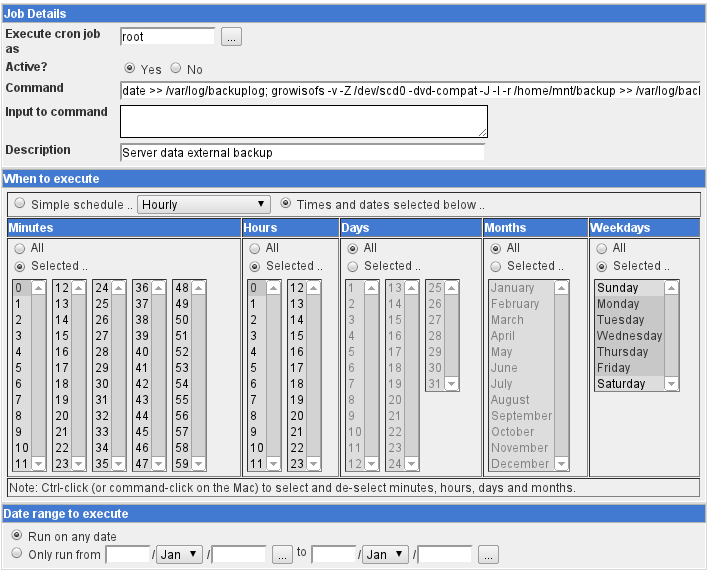
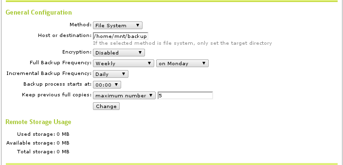

.. _backup:

#############################
 Backing Up Server Data
#############################

The AAltSys Server provides robust, simple, and inexpensive options for data 
backup. Backups can be written to DVDs for a small amount of information, but 
we recommend using auto-mounted USB or eSATA drives to handle large data sets. 
For instructions on preparing (an external) drive for storing backups, refer to
article :ref:`resources/backupdrive`.

Restoring Backups
=============================

Backups are stored in Duplicity rsync format. Duplicity is available for free 
on Linux and Mac. The Linux version of Duplicity can execute on Windows under 
Cygwin; an ISO image of Duplicity encapsulated in Cygwin is being developed. 

.. _backup_configuration:

Performing a Demand Backup
=============================

To manually perform a backup on Zentyal 2.2 or later run one of the following 
commands::

   sudo /usr/share/zentyal-ebackup/backup-tool --full
   sudo /usr/share/zentyal-ebackup/backup-tool --incremental

To manually perform a backup on Zentyal 2.0 (older) run one of these commands::

   sudo /usr/share/ebox-ebackup/ebox-remote-ebackup --full
   sudo /usr/share/ebox-ebackup/ebox-remote-ebackup --incremental

Backup Configuration
=============================

Backups are written inside of the **/home** directory. The directory for backups 
is created with the terminal command::

   sudo mkdir -p /home/mnt/backup/source_config

Linux cron jobs perform backup functions. Zentyal manages cron tab entries for 
Duplicity operations. Writing backup files to external media requires entering 
cron jobs using Webmin. An example entry for writing to DVD is shown following:

The software for writing DVDs may be missing from the OS. It is installed with 
the command::

   sudo apt-get install dvd+rw-tools

Configure Zentyal
-----------------------------

Backups are managed in Zentyal. From the universe of potential configurations, 
the following arrangement is suggested to provide the flexibility and capability 
required in most situations.

*  Open Zentyal, and navigate to tab 
   :menuselection:`Core --> Backup --> Configuration and Status`
*  Set the backup path to :kbd:`/home/mnt/backup`
*  Leave prompts ``User:`` and ``Password:`` blank
*  Fill in a schedule for full and incremental backups as shown following:

*  Navigate to tab :menuselection:`Core --> Backup --> Includes and Excludes`
*  Enter Includes and Excludes as shown in the following image:

.. image:: _images/backup_exclude.png

Moving Home Files to Server
-----------------------------

Storing important files on workstation hard drives is not only risky, but 
inconvenient to business operations. Instead, a user should manage files in 
server directories. To guarantee that new files are created there, set the 
user's server home folder as the default directory in programs. Server-based 
home folders work across platforms such as Windows PCs and Apple desktops, 
as described in the following table:

+--------------------+------------------------------+------------+-----------------+
| Workstation type   | Connection to server home    | Works from | Instructions    |
+====================+==============================+============+=================+
| LTSP terminals     | uses /home/$USER by default  | local only | no instructions |
+--------------------+------------------------------+------------+-----------------+
| Windows PCs        | maps /home/$USER to drive H: | local only | instructions    |
+--------------------+------------------------------+------------+-----------------+
| Linux workstations | ssh link to /home/$USER      | Internet   | instructions    |
+--------------------+------------------------------+------------+-----------------+
| Apple desktops     | ssh link to /home/$USER      | Internet   | instructions    |
+--------------------+------------------------------+------------+-----------------+

What Is Backed Up
-----------------------------

*  Server configuration data, eBox Database 
*  Printer configuration data, /etc/cups
*  Virtual machine images, /home/convirt
*  Shared files, /home/samba/shares/...
*  Home directories, /home/$USER...

What Is Not Backed Up
-----------------------------

The base operating system of the server is not backed up. For an OS backup to 
be useful, we would need to answer the following questions:

*  How can you backup the operating system when it is running?
*  Without a working operating system, how would you restore the OS?

Instead of trying to backup the server OS, we have made AAltSys Server OS 
installation relatively fast and simple. Keep the AAltSys or Zentyal install 
DVD handy, along with a list of any console changes to the server 
configuration.

Creating a Server Clone Image
=============================

Use the CloneZilla utility disk to create a complete server image, stored on 
your backup drive.

-----------------------------

.. rubric:: Footnotes

.. [#] https://help.ubuntu.com/community/Autofs

.. [#] http://unix.stackexchange.com/questions/85061/automount-not-disabling-in-ubuntu-12-04-or-13-04

.. [#] https://help.ubuntu.com/community/Mount/USB
