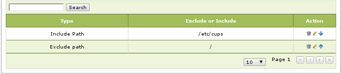

################################
 Redundant Server Setup
################################

Two AAltSys servers on the same network, a primary server and a backup server, 
can provide redundant data storage and server functions. In case the primary 
server fails, a few commands issued on a backup server will allow it to assume 
the role of the primary server. This guide describes installing a backup server, 
adding it to the network, and configuring the primary server to backup to it.

Two common approaches to creating a redundant server array are: file copy, and
device replication. The simpler approach is to copy files from the primary 
server to the backup system, as this involves nothing more than operating 
system command line steps. Device replication, where the devices containing 
data are mirrored between primary and backup machines, requires special system 
and device configuration. This procedure creates a filecopy redundant server.

File Copy Backup Server
==============================

Switching to a Backup Server
""""""""""""""""""""""""""""""

To switch to a backup server, the primary server must first be shutdown. If the 
primary server is a network gateway machine, then move the external network 
interface connection (NIC device eth0) from the primary server to the backup 
server. Then::

	 Login to the backup server, and start Zentyal.
	 Navigate to :menuselection:`Core --> System --> Backup --> General`.
	 Change the :guilabel:`Host or destination` to :kbd:`/home/mnt/backup/source_config`
	 Go to :menuselection:`Core --> System --> Backup --> Services Restore`. 
	 Run the selection: :kbd:`Restore Zentyal configuration from Backup`.
	 Click :kbd:`Save Changes` on the Zentyal title bar, and then :kbd:`save`.

The following issues are noted with this procedure::

#.	 Zentyal progress bar hangs at 88% when saving changes. Close Firefox and reopen it to clear this hang.
#.	 __Hostname__ on the redundant server is not replaced when restoring. Go to :menuselection:`Core --> System --> General --> Hostname` and change the name to `__Hostname__.local.aaltsys.net`.

.. Note:: 
	 The redundant server stores configuration backups for the primary server
	 and data backups for the redundant server. To restore data files, got to 
	 :menuselection:`Core --> System --> Backup --> Restore Files` and select 
	 backup dates, then choose directories or files to restore.

Server Configuration Differences
"""""""""""""""""""""""""""""""""""

When a primary server is installed in the default configuration, then 
differences in the Zentyal configuration for primary and backup servers are 
documented following (Changed settings are in italics):

+----------------+----------------------------------+---------------------------------+
| Menu item      | Primary server value             | Redundant server value          |
+================+==================================+=================================+
| Hostname       | aaltsysserver.local.aaltsys.net  |`backupserver.local.aaltsys.net` |
+----------------+----------------------------------+---------------------------------+
| Netbios Name   | aaltsysserver                    |`backupserver`                   |
+----------------+----------------------------------+---------------------------------+
| eth1 - IP      | 192.168.2.241                    |`192.168.2.242`                  |
+----------------+----------------------------------+---------------------------------+
| DHCP ranges    | 192.168.2.1 - 192.168.2.200      |`no default range`               |
+----------------+---------+------------------------+---------+-----------------------+
| Backups        | Include | /etc/cups              | Include | /etc/cups             |
+----------------+---------+------------------------+---------+-----------------------+
|                | Exclude | /                      | Include | /home                 |
+----------------+---------+------------------------+---------+-----------------------+ 
|                                                   | Exclude | /home/mnt             |
+---------------------------------------------------+---------+-----------------------+                 
|                                                   | Exclude | /                     |
+---------------------------------------------------+---------+-----------------------+

Additional changes are required for external backup drives. Connect an external 
backup drive to the redundant server only, and remark out the corresponding 
**autofs** drive configuration on the primary server.

Configure the Backup Server
""""""""""""""""""""""""""""""""

.. Warning::
	 Connect a monitor, keyboard, and mouse directly to the backup server and 
	 configure the server according to this guide before connecting it to the 
	 local network.

Make these changes in **Zentyal** to configure the backup server for its role: 

.. Note::
	 The default value of **[backup_IP]** would be **192.168.2.242** as shown in 
	 the preceding table. Substitute values according to your network IP.

+-------------------------------------------------------+-----------------------------------+
|Zentyal menu location                                  | Redundant server value            |
+=======================================================+===================================+
|Core > System > General > Hostname                     |``backupserver.local.aaltsys.net`` |
+-------------------------------------------------------+-----------------------------------+
|Office > File Sharing > General Settings > Netbios Name|``backupserver``                   |
+-------------------------------------------------------+-----------------------------------+
|Core > Network > Interfaces > eth1                     |``192.168.2.242``                  |
+-------------------------------------------------------+-----------------------------------+
|Infrastructure > DHCP > eth1 > Ranges > default        |``(delete the default range)``     |
+-------------------------------------------------------+-----------------------------------+

Configure the Primary Server
""""""""""""""""""""""""""""""

Install scripts for data transfer between servers by executing the following 
commands (use either a console terminal or an ssh session to the server's 
terminal shell)::

  sudo su -
  ## in case autofs is configured #########
  sed -i '$d' /etc/auto.master
  service autofs restart
  ## end autofs reconfiguration ###########
  mkdir -p /home/mnt/backup/source_config
  mkdir -p /root/.ssh/  
  if [ ! -f "/root/.ssh/id_rsa" ]; then ssh-keygen -N "" -f /root/.ssh/id_rsa; fi
  scp /root/.ssh/id_rsa.pub admin1@[backup_IP]:~/
  wget https://raw.github.com/gist/870781/rsync-data -O /usr/bin/rsync-data
  wget https://raw.github.com/gist/870783/rsync-config.sh -O /usr/bin/rsync-config
  chmod +x /usr/bin/rsync-data
  chmod +x /usr/bin/rsync-config
  exit

Next, log into Webmin at https://aaltsysserver.local.aaltsys.net:10000. 
Navigate the menu to :menuselection:`Core --> System --> Scheduled cron jobs`, 
and add three cron jobs to run each night. The last two of these jobs may be 
scheduled to run throughout the day as well, provided none of the software 
being used has problems with file locking. Settings for the cron jobs are 
shown in the following screenshot:

.. image:: _images/backup_cron_primary.png

Be sure to change the job **Description** and **Command** within the jobs 
as shown in the table:

+----------------------+----------------------------------------------------------+
| Job Description      | Command                                                  |
+======================+==========================================================+
| Clear Backup Locks   | rm /tmp/lock*                                            |
+----------------------+----------------------------------------------------------+
| Backup data          | /usr/bin/rsync-data [backup_IP] mnt/                     |
+----------------------+----------------------------------------------------------+
| Backup configuration | /usr/bin/rsync-config [backup_IP] /home/mnt/backup       |
+----------------------+----------------------------------------------------------+

Zentyal backup module general configuration is shown in the following screenshot:

.. image:: _images/backup_config_primary.png

Settings for the backup Includes and Excludes tab are also shown following:

Configure SSH on Backup Server
""""""""""""""""""""""""""""""

At the backup server, open a terminal session and configure ssh with the 
commands:: 

	 sudo su -
	 service autofs stop
	 mkdir -p /home/mnt/backup/source_config
	 service autofs start
	 mkdir -p /root/.ssh
	 cat /home/admin1/id_rsa.pub >> /root/.ssh/authorized_keys
	 rm /home/admin1/id_rsa.pub
	 exit

.. Note::
	 It is important to use two greater than symbols in the previous commands 
	 so that any existing keys are not erased.

.. Warning::
	 Connect the removable drive to the redundant backup server. Connecting the 
	 external drive to the primary server on eSATA may prevent the server from 
	 rebooting.

For instructions on setting up an external backup drive, see 
:ref:`backup`.

Configuring a Backup Server
=================================

The primary server configuration can be restored to a backup server at any 
time. Here is a brief outline of the steps for this to work:

+ On the primary server, make sure that a configuration backup has run.
+ On the primary server, run the cron job ``rsync-config`` to propagate the backup.
+ Disconnect the redundant server from the network.
+ On the redundant server, set the backup directory to ``/home/mnt/backup/source_config``.
+ Perform a services restore on the redundant server.
+ Reset the redundant server settings as described previously.
+ Shutdown the redundant server, reconnect it to the network, and restart.

Device Replication Backup Server
=================================

Due to the natue of current AAltSys install procedures, setting up replication 
is technical and tedious. Basically, the the home partition must be backed up, 
erased, recreated using Linux-HA, and then the files and permissions must be 
reinstalled. Directions for using Linux-HA are available at 
http://www.linux-ha.org/.
