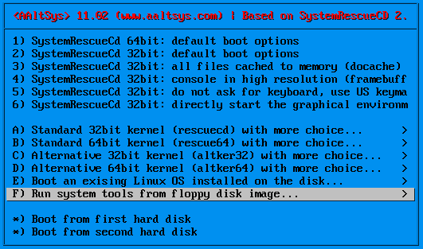
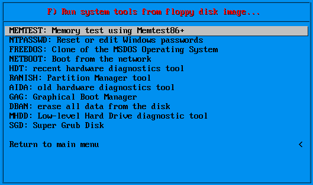

####################################
SysRescue Boot Utilities
####################################

.. note::
	This documentation is extracted from the System Rescue CD documentation found on line at http://www.sysresccd.org/Online-Manual-EN. Please refer to the original documentation there.

SystemRescueCd allows you to do many administration tasks by booting from virtual floppy disks. Virtual floppy booting is comparable to starting the computer from a physical floppy disk, in that the hard drive is accessible but not active. This permits many repair functions such as system backup, password recovery, data repair, and hardware testing.

Boot Floppy Disks Overview
==============================

To boot from a virtual floppy, first start the computer from the SysRescueCD to see the first menu, as shown below.

From the SysRescueCD main menu, select item *F)* to see a list of available virtual boot images:

Select an item from the list to boot an image which will run the corresponding program.

**MEMTEST**: Use *MemTest+* to test system memory for damage.

**NTPASSWD**: Use *NT Password and Registry editor* to change system information in Windows installations. Of most interest is the ability to change the password of a user account. Now, you will not have to reinstall Windows if you forget the password of the administrator account, as you can edit the password with this utility. This program also allows you to edit the Windows registry, even when Windows is installed on an NTFS disk.

**FREEDOS**: To start a DOS session, select *FreeDos* from the menu. FreeDos is a free operating system compatible with MS-DOS. It allows you to run DOS programs such as Partition Magic or Drive Image without an MS-DOS license.

**NETBOOT**: Select *Network Booting* to boot from a network image for computers which do not support PXE, or which are not set to enable PXE booting in the BIOS.

**HDT**: *Hardware Diagnostics Tool* is an advanced diagnostic system program which will detect your computer hardware, such as the processor, chipset, mainboard, network card, and so forth. It is very useful, for example, when you want to download a driver and you don''t know which one to take.

**ranish**: The *Ranish Partition Manager* is a low level partition manager with power, unlike *Fdisk* from Microsoft.

**AIDA**: *Advanced Information Diagnostics Tool* is a diagnostic program similar to *HDT*. While superceded, it is still in common use.

**GAG**: *Graphical-Boot-Manager* is a working boot manager similar to *Lilo*, *Grub*, or *Boot-Magic*.

**DBAN**: Use *Darik''s Boot and Nuke* to destroy all data on a computer''s drives. For example, use *Dban* before selling or giving away a computer.

.. Warning::
	*Dban* is intended to produce irretrievable data loss.

**MHDD**: Use *Hard Drive Diagnostics* to perform low-level diagnostics on a hard drive.

**SGD**: Use the *Super Grub Disk* bootloader to identify and manage bootable devices.
